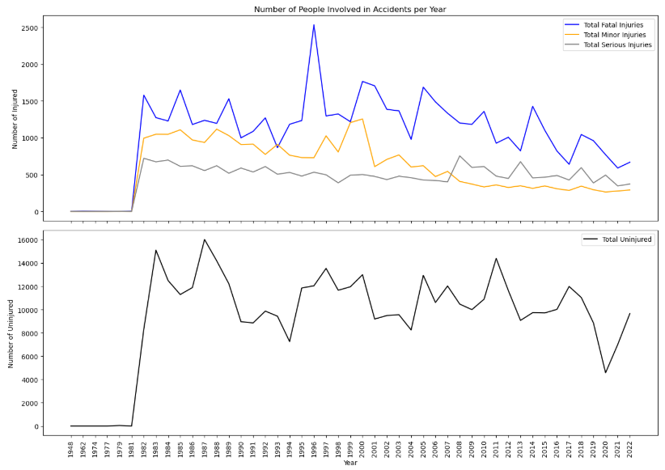
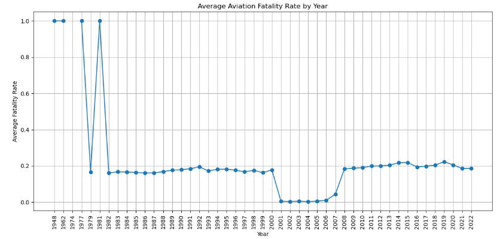
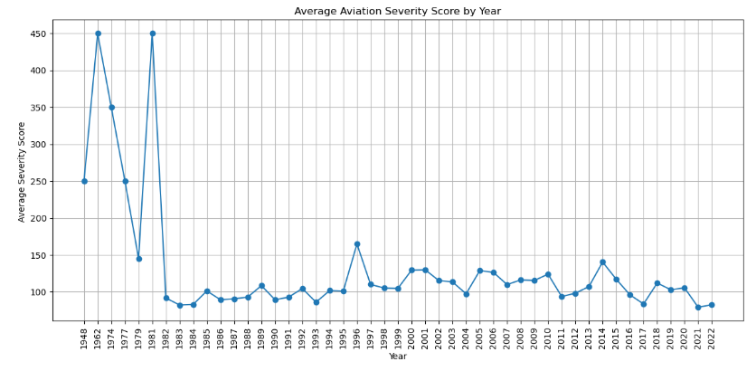

## Project Title: Risk-Optimized Aircraft Acquisition Strategy for Commercial and Private Aviation Venture
**Overview**
We are presented with a business problem in which we are expected to utilize historical information in the aviation industry to clean, explore and perform necessary analysis and provide evidence for decision-making. 

## Business Understanding
Our company is embarking on an exciting expansion into the aviation sector, aiming to diversify our business portfolio by purchasing and operating aircraft for both commercial and private enterprises. This strategic move taps into growing demand for flexible, premium air travel options while positioning us in a high-value industry with strong long-term potential. As with any new venture, it is critical that we fully understand the operational risks inherent to aviation, particularly regarding aircraft safety and reliability, to ensure we protect our brand, investments, and customers.

To support this initiative, a detailed analysis of historical aviation incident data will be conducted. Our primary focus will be identifying aircraft models that demonstrate historically low risk based on factors such as fatalities, serious injuries, minor injuries, and incidents of aircraft destruction. Aircraft with minimal or no record of major accidents will be prioritized, ensuring that we recommend only the safest and most reliable models for acquisition. This risk-centered approach will provide us with the confidence that we can build an aviation division that not only meets market demand but does so with a strong emphasis on safety, operational resilience, and regulatory compliance. By leveraging this data-driven method in our purchasing strategy, we significantly increase the chances of operational success while mitigating potential liabilities. This understanding of the industry risks, coupled with a careful aircraft selection process, sets a strong foundation for a safe, scalable, and profitable aviation division.

### Project goal
Our project goal is to identify aircraft models that present the lowest operational risk based on analysis of historical aviation incident data.

#### *Key Questions*
* Which aircraft models have the lowest rates of fatal and serious accidents?
* Which aircraft models have the fewest incidents resulting in the aircraft's damage?
* What types of aircraft are suitable for private and commercial enterprises?

### Project Stakeholders
In this project, several stakeholders are targeted in this new venture. They include; the company owners, company staff, suppliers, airline regulatory organs, clients including the general public. However, our primary focus at this point in our primary stakeholder requiring our advice based on our expert opinion is the head of the new aviation division. We aim to  provide reliable and actionable data insights for informing decisions on aircraft selection and operational strategies for businesses entering the aviation industry

## Data Understanding and Analysis

### *Dataset*
The [Aviation Accident Database Synopses](https://www.kaggle.com/datasets/khsamaha/aviation-accident-database-synopses) downloaded from Kaggle is a structured dataset containing detailed summaries of aviation accidents and incidents reported by the USA National Transportation Safety Board (NTSB). The dataset has 90,348 records and 31 columns (variables), with historical aviation recorded between 1940s to 2020s, covering both domestic and some international cases. The dataset also provides additional data relating to operational, environmental, and human factors that contribute to aviation accidents. 
Some of the key variables in the dataset include;

          * Event Date
          * Location
          * Country
          * Aircraft Make and Model
          * Injury Severity
          * Aircraft Damage Level
          * Purpose of Flight
          * Weather Conditions

### *Data Analysis Plan*
    1. Check for duplicates records and drop
    2. Check for missing values and appropriately address (example fill missing injury counts with zeros and remove entries with missing Make/Model)
    3. Standardize categories by  cleaning inconsistent entries (example different spellings or formats for the same manufacturer).
    4. Create new columns necessary for analysis and visualization (Example: year variable)
    5. Create risk indicators: Summarize incidents into a composite Risk Score (weighing fatalities, injuries, and destruction).
    6. Narrow down the scope for analysis (focus analysis on commercial or private flights based using on Purpose of Flight avariable).
    7. Create required visualizations and interpet

### *New categorical variable*

To make our analysis useful, we need to create a variable that qualifies aircraft by passengers' volume variable (Total_Occupants) into some categories used in the aviation industry. This categorization will be useful in determining the low-risk airlines that our company can acquire. Using secondary information, we generated some categories as tabulated below.

|Category Name	      | Typical Passenger Range| Flight type                                |Category       |
----------------------|------------------------|--------------------------------------------|---------------|
|Regional Aircraft    | 19 to 100 passengers   |Short-haul domestic, Regional               |Domestic       |
|Small Narrow-body    | 100 to 150 passengers  |Short to medium-haul domestic and regional  |Regional       |
|Standard Narrow-body | 150 to 220 passengers  |Medium-haul domestic and short international|Regional       |
|Small Wide-body      | 220 to 300 passengers  |Medium to long-haul international           |International  |
|Large Wide-body	  | 300 to 400 passengers  |Long-haul international, intercontinental   |International  |
|Very Large Aircraft  | 400+ passengers        |Ultra long-haul, high-density hubs          |Ultra-long haul|

Also, for private enterprise acquisition strategy, we could consider the passenger volume (capacity) and flight range. In this data, we will similarly use total passenger volume to qualify the categories and create a new column that would enable us choose the less-risk aircraft for private enterprise.

|Category Name	      | Typical Passenger Range| Flight type                                |Category       |
----------------------|------------------------|--------------------------------------------|---------------|
|Very Light Jets (VLJs)| 2–4 passengers   |Short regional trips (1-2 hour flights)          |Domestic       |
|Light Jets    | 5–8 passengers  |Short-haul business trips, private charters  |Regional       |
|Midsize Jets | 7–10 passengers  |Cross-country U.S. flights, medium-range international|Regional       |
|Super-Midsize Jets     | 8–12 passengers  |U.S. coast-to-coast, Europe-Middle East           |International  |
|Large Cabin Jets	  | 10–16 passengers  |Transatlantic, international business travel   |International  |
|Ultra-Long-Range Jets  | 12–19 passengers        |Global nonstop flights (e.g., New York to Tokyo)    |Ultra-long haul|
|VIP Airliners (Bizliners)  | 20–100+ passengers        |VIP groups, heads of state, luxury charters   |Ultra-long haul|

### Data Visualization

**Interpretation** 
Overall, the data shows that before 1981 the number of people involved in aviation accidents were nearly negligible. Secondary information indicates that this period in aviation industry was characterized by rapid growth, technological innovation, and a shift towards a more deregulated and competitive market, ultimately leading to the consolidation of the industry. Thus, we can't absolutely say air flights were most safe during this period. Post 1981, reveals a surge in number of people injured (fatal, minor and serious, and subsequent drop in the number of accidents reported incidences. Similar trends are observed on the total uninjured passengers involved in flight accidents. The likely explanation for this gradual improvement in air safety may relate to changes in aviation regulations, mandatory reporting laws, or more thorough NTSB accident investigations starting in the early 1980s. Also, a sharp reduction in number involved in accidents in the year 2020. This period was characterized by reduction of flights volumes due to restrictions put forth to contain the spread of the COVID-19 pandemic.

**Interpretation** The graph displays the Average Aviation Fatality Rate by Year from 1948 to 2022. In the early years (1948–1980), the fatality rate is extremely high, reaching 1.0 (100%) in several years, indicating that accidents during that period were often fatal. Around 1979 to 1981, there is a sharp fluctuation with a temporary drop, suggesting some safer incidents or fewer fatalities during those specific years. From the early 1980s onward, the fatality rate shows a substantial decline and stabilizes around 0.16 to 0.2, reflecting significant improvements in aviation safety, technology, and regulation. Notably, between 2001 and 2007, the fatality rate drops dramatically to almost zero, indicating an exceptionally safe period. After 2008, the fatality rate slightly increases and stabilizes again between 0.18 and 0.22, suggesting a consistent but slightly higher fatality risk in more recent years compared to the early 2000s. Overall, the long-term trend clearly shows a major improvement in aviation safety compared to the earlier decades.

**Interpretation** The graph shows the Average Aviation Severity Score by Year from 1948 to 2022. In the early years, particularly around 1962 and 1981, severity scores peaked sharply at around 450, indicating very serious and deadly aviation incidents with significant fatalities, injuries, and aircraft destruction. From the early 1980s onward, there is a notable and sustained decline in severity scores, stabilizing around 80 to 140 points. The data shows occasional minor spikes, such as in 1996, 2001, 2005, and 2014, but these increases are relatively small compared to earlier decades. Overall, the trend highlights a significant improvement in aviation safety over time, with modern aviation accidents being generally less severe than those in the early and mid-20th century. The downward movement and stabilization of severity scores suggest that industry safety measures, technological improvements, and stricter regulations have had a substantial positive impact on reducing the severity of aviation accidents.

### Interactive Dashboard

[View Interactive Dashboard](https://public.tableau.com/views/Phase1_Project_Dashboard/ARM-Dashboard?:language=en-US&:sid=&:redirect=auth&:display_count=n&:origin=viz_share_link)

## Conclusion
Summary of conclusions including three relevant findings

Our **Project goal** was to identify aircraft models that present the lowest operational risk based on analysis of historical aviation incident data. To achieve this goal, we formulated three key questions to guide our data analysis and eventually make an informed decision. In these three questions, we sought to establish:
* Aircraft makes/models with the lowest rates of fatal and serious accidents
* Aircraft make/models have the fewest incidents resulting in the aircraft's damage
* Identify aircraft that are suitable for private and commercial enterprises

To answer these questions, we took a risk-centered approach to generate the evidence necessary to build an aviation division that not only meets market demand but does so with a strong emphasis on safety, operational resilience, and regulatory compliance. We performed necessary data cleaning procedures and created two columns based on the existing secondary information relating to passenger volume, flight types and the range.

**Table for categorization of corporate aircrafts**
|Category Name	      | Typical Passenger Range| Flight type                                |Category       |
----------------------|------------------------|--------------------------------------------|---------------|
|Regional Aircraft    | 19 to 100 passengers   |Short-haul domestic, Regional               |Domestic       |
|Small Narrow-body    | 100 to 150 passengers  |Short to medium-haul domestic and regional  |Regional       |
|Standard Narrow-body | 150 to 220 passengers  |Medium-haul domestic and short international|Regional       |
|Small Wide-body      | 220 to 300 passengers  |Medium to long-haul international           |International  |
|Large Wide-body	  | 300 to 400 passengers  |Long-haul international, intercontinental   |International  |
|Very Large Aircraft  | 400+ passengers        |Ultra long-haul, high-density hubs          |Ultra-long haul|

Also, for private enterprise acquisition strategy, we could consider the passenger volume (capacity) and flight type.

**Table for categorization of private aircrafts**
|Category Name	      | Typical Passenger Range| Flight type                                |Category       |
----------------------|------------------------|--------------------------------------------|---------------|
|Very Light Jets (VLJs)| 2–4 passengers   |Short regional trips (1-2 hour flights)          |Domestic       |
|Light Jets    | 5–8 passengers  |Short-haul business trips, private charters  |Regional       |
|Midsize Jets | 7–10 passengers  |Cross-country U.S. flights, medium-range international|Regional       |
|Super-Midsize Jets     | 8–12 passengers  |U.S. coast-to-coast, Europe-Middle East           |International  |
|Large Cabin Jets	  | 10–16 passengers  |Transatlantic, international business travel   |International  |
|Ultra-Long-Range Jets  | 12–19 passengers        |Global nonstop flights (e.g., New York to Tokyo)    |Ultra-long haul|
|VIP Airliners (Bizliners)  | 20–100+ passengers        |VIP groups, heads of state, luxury charters   |Ultra-long haul|

We further developed two risk-based metrics to help us filter choices and converge to a specific decision on acquisition. Based on this process, we present the following summary.

**Commercial Enterprise Aircraft**

Using the grouping of the aircraft, by categories in column one, and computation of fatality rate and severity score, a two-step process was employed in zeroing into the least-risk aircraft. Aircrafts with zero risk ratings were considered and picked for consideration as those that can be acquired for commercial enterprise. The summary is as tabulated below, with our findings narrowing in favour of PIPER PA-44-180 and PIPER PA-42-720 being under Standard Narrow-body and Small Wide-body respectively.

***Fatality and Severity score table***
|Category Name	      | Typical Passenger Range| Fatality rate  | Severity score |Recommendation|
----------------------|------------------------|-----------------|---------------| -------------------------|
|**Regional Aircraft**    | 19 to 100 passengers   |0.000000  | 105.000000 | Drop due to high severity score|
|**Small Narrow-body**   | 100 to 150 passengers  |0.000000 | 6.666667 |Drop due to high severity score, however consider if exploring low-risk aster next two aircrafts|
|**Standard Narrow-body** | 150 to 220 passengers  |0.000000| 0.000000| Consider purchasing PIPER PA-44-180|
|**Small Wide-body**     | 220 to 300 passengers  |0.000000  |0.000000|Consider purchasing PIPER PA-42-720|

***Private Enterprise Aircraft***
Similary, the same approach was employed in determining the most sutable aircraft for private enterprise. With our findings favouring the purchase of CESSNA 172P to facilitate Global nonstop flights (e.g., New York to Tokyo) for passengers between 12 and 19 passangers. 

***Fatality and severity score table***
|Category Name	      | Typical Passenger Range| Fatality rate    | Severity score       | Recommendation |
----------------------|------------------------|------------------|----------------------|-------------------------------|
|**Large Cabin Jets**	  | 10–16 passengers  |0.000000    |    46.0  | Drop due to high severity score|
|**Ultra-Long-Range Jets**  | 12–19 passengers        |0.000000    |   0.0  | Consider purchasing CESSNA 172P |
|**VIP Airliners (Bizliners)**  | 20–100+ passengers        |0.000000 |    30.0   | Drop due to high severity score |

## Recommendation
1. **Commercial Aircraft acquisition**
Based on risk assessment, two categories of aircrafts with zero fatality and severity emerge. 
* **The Standard Narrow body** which has passenger capacity of between **150 and 220 passengers**. The suitable aircraft make and model for consideration is **PIPER PA-44-180**
* **Small Wide-body** which has a passenger capacity of between  **220 and 300 passengers**. The suitable aircraft make and model for consideration is **PIPER PA-42-720**
These two aircrafts recommended provide the company with an to explore Medium-haul domestic including short, Medium to long-haul international flights. Thus, with the acquisition, the company can commercially explore both domestic, regional and international airline routes.

2. **Private Aircraft Acquisition**
Based on risk assessment, one category of aircraft present zero fatality rate and severity score. This alligns well with our risk centrered approach, that is; 
* The company through the head of aviation division should consider acquisition of **Ultra-Long-Range Jets** with a passenger range of **12 to 19 passengers**. The most suitable aircraft under this category is **CESSNA 172P**. The aircraft can provide global nonstop flights (e.g., between New York to Tokyo). Thus favourable for Ultra-long haul of private clients.

